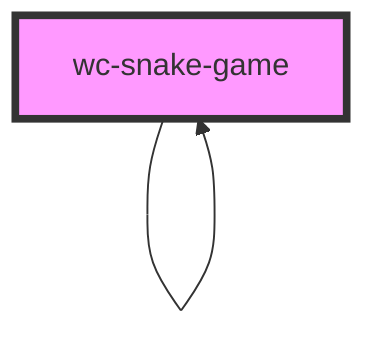

# app-game

<!-- Auto Generated Below -->

## Properties

| Property | Attribute | Description | Type                    | Default |
| -------- | --------- | ----------- | ----------------------- | ------- |
| `size`   | `size`    |             | `10 \| 100 \| 20 \| 50` | `10`    |

## Events

| Event    | Description | Type                                                |
| -------- | ----------- | --------------------------------------------------- |
| `change` |             | `CustomEvent<{ score: number; state: GameState; }>` |

## Dependencies

### Used by

 - [wc-snake-game]()

### Depends on

- [wc-snake-game]()
- [app-pixel](../app-pixel)

### Graph

----------------------------------------------

*Built with [StencilJS](https://stenciljs.com/)*
